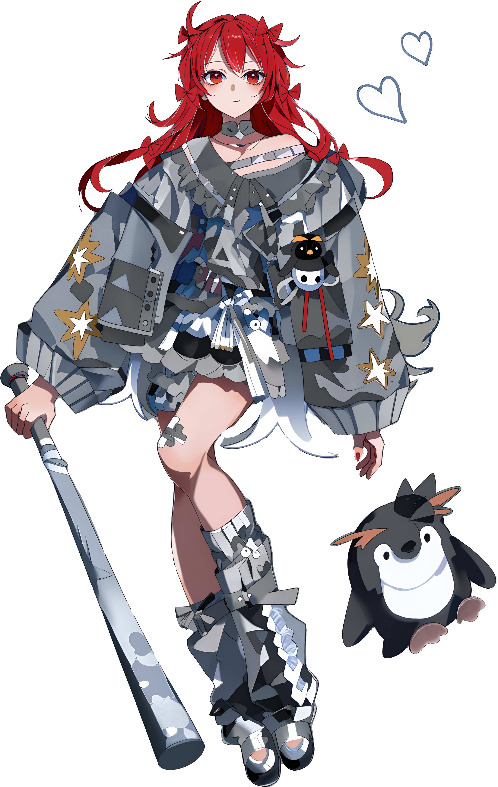

[English](./README.md) | [中文](./README.zh.md)

# Hello, I'm SuBaiShan (素白杉)

I'm a university student from China, a developer exploring the fields of AI and full-stack development.

Technically, Python is my main language, and YOLO is my old friend. I've built proper projects with Django and Flask, and can set up working backends. I've also worked with Vue on the frontend, used MySQL and Redis as databases, and written some embedded code in C. I may not be an expert in every layer, but I can put them all together to build a complete product.

I love open source and anything interesting, and I'm trying to integrate AI into them. I hope to become someone who can turn ideas into real works, whether it's a tool or just a fun little concept. Technology is only a means; the goal is to create something that people will remember.

On the right is my virtual character — Xiao Yu.

- I'm currently working on some interesting projects: [Repositories](https://github.com/subaishan?tab=repositories)
  - For example, YOLO deployment solutions [yolo-cocoon-detection](https://github.com/subaishan/yolo-cocoon-detection), an interactive AI knowledge graph [AI-Knowledge-Graph](https://github.com/subaishan/AI-Knowledge-Graph), and a Qt-based current detection host computer [load-forecast-qt](https://github.com/subaishan/load-forecast-qt)
- Outside of studying, I enjoy reading, playing games, and sleeping.

<!-- github-stats:start -->

<!-- github-stats:end -->

### Languages

<!-- languages:start -->
<code></code>
<code></code>
<code></code>
<code></code>
<!-- languages:end -->

### Frameworks and Tools

<!-- tools:start -->
<code></code>
<code></code>
<code></code>
<code></code>
<code></code>
<code></code>
<code></code>
<!-- tools:end -->

### Interested

<!-- interested:start -->
<code></code>
<code></code>
<!-- interested:end -->

> If you also want to know how this overview is generated?  
> I wrote a script to generate it automatically. You can check it here[subaishan/subaishan](https://github.com/subaishan/subaishan)  
> This is a Python version modified from [YunYouJun/YunYouJun](https://github.com/YunYouJun/YunYouJun/tree/master/scripts).
---
You can find ways to contact me in the sidebar. Follow me to discover more interesting things.
